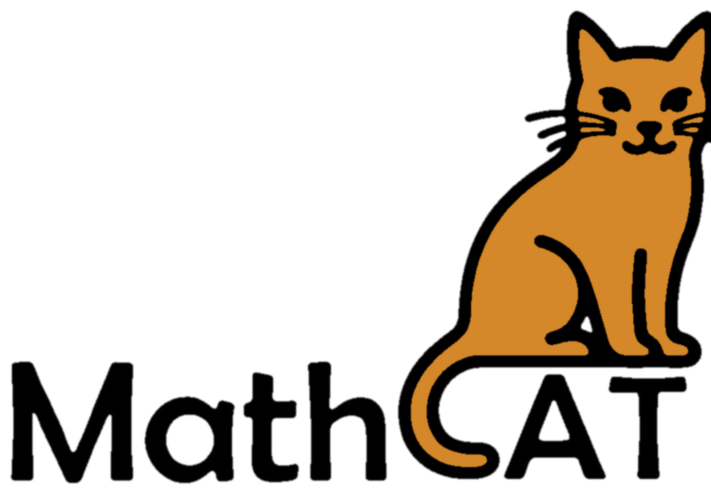

#  Руководство пользователя MathCAT

MathCAT — это инструмент, который используется вместе с экранным диктором. С помощью MathCAT математические выражения можно прослушивать или читать на брайлевском дисплее.

MathCAT встроен в экранные дикторы NVDA и JAWS, поэтому устанавливать его как дополнение не требуется.

## Начало работы с MathCAT

Работайте с веб-страницей или электронной книгой с помощью экранного диктора как обычно. Когда вы дойдёте до математического выражения, экранный диктор автоматически его озвучит. Чтобы изучить выражение подробнее, нажмите пробел и перейдите в режим навигации. В NVDA также можно нажать NVDA+Alt+M. Чтобы выйти из режима навигации, нажмите Escape.

### Основные сочетания клавиш

- Для перемещения внутри математического выражения используйте стрелки влево, вправо, вверх и вниз.
- Для перемещения между ячейками таблицы используйте Ctrl+стрелка.
- Чтобы перейти к началу выражения, нажмите Home, а чтобы перейти к концу — End.
- Чтобы услышать текущую позицию, нажмите пробел.
- Для смены режима навигации нажимайте Shift+стрелка вверх или Shift+стрелка вниз. Подробнее см. в разделе [«Все команды навигации»](#все-команды-навигации).

Во время навигации по выражению сочетание Ctrl+C копирует код MathML текущего узла выражения.

В режиме навигации доступно гораздо больше возможностей. Все они описаны в разделе [«Все команды навигации»](#все-команды-навигации).

## Настройка MathCAT

MathCAT можно настроить в соответствии со своими потребностями. Чтобы открыть настройки в NVDA, нажмите NVDA+N, выберите «Параметры», затем «Настройки MathCAT». В списке категорий доступны три раздела: «Речь», «Навигация» и «Брайль».

### Речь

Ниже перечислены настройки речи и их возможные значения. Значение по умолчанию указано в квадратных скобках.

- Особенности восприятия:
  - \[Слепота.\] Озвучивание не допускает неоднозначности.
  - Слабовидение. Озвучивание короче.
  - Трудности в обучении. Озвучивание короче.
- Язык (по умолчанию используется язык экранного диктора):
  - \[Английский (en)\]
  - Немецкий (de)
  - Греческий (el)
  - Испанский (es)
  - Финский (fi)
  - Французский (fr)
  - Венгерский (hu)
  - Индонезийский (id)
  - Норвежский букмол (nb)
  - Польский (pl)
  - Русский (ru)
  - Шведский (sv)
  - Вьетнамский (vi)
  - Традиционный китайский (zh-tw)
- Стиль речи:
  - \[ClearSpeak.\] Выражения произносятся примерно так, как их произнёс бы учитель на уроке.
  - SimpleSpeak. Выражения произносятся короче, но иногда такое озвучивание может быть неоднозначным.
- Подробность:
  - Краткая. Опускаются дополнительные слова, подобные артиклю и предлогу в английском выражении «the square root of x».
  - \[Средняя.\] Компромисс между кратким и подробным озвучиванием.
  - Подробная. Произносятся все слова, поэтому озвучивание не допускает неоднозначности.
- Скорость математической речи:
  - \[100\], допустимы значения от 1 до 1000. Определяет скорость озвучивания математических выражений относительно скорости экранного диктора. Значение задаётся в процентах: 100 соответствует той же скорости, меньшее значение замедляет речь, а большее — ускоряет.
- Коэффициент пауз:
  - \[1\], допустимы значения от 0 до 10. Определяет длительность пауз при озвучивании математических выражений.
- Звуковой сигнал:
  - \[Нет.\]
  - Сигнал. Перед каждым математическим выражением и после него воспроизводится звуковой сигнал.
- Химия:
  - \[Озвучивать.\] Химические формулы читаются как формулы, например «H два O» для $H_2O$.
  - Выключено. Для $H_2O$ произносится «H, нижний индекс 2, O».

### Навигация

MathCAT позволяет подробно изучать выражение, перемещаясь по нему и прослушивая отдельные части. В настройках навигации можно выбрать способ перемещения и требуемую подробность информации.

Ниже перечислены настройки и их возможные значения. Значение по умолчанию указано в квадратных скобках.

- Режим навигации при входе в выражение:
  - \[Расширенный.\] Перемещение между математически значимыми частями выражения, например числителем, знаменателем, показателем степени и выражением в скобках.
  - Простой. Перемещение по словам. Определённые конструкции, например квадратный корень, озвучиваются целиком.
  - Посимвольный. Перемещение по словам или числам. После увеличения детализации каждая буква или цифра читается отдельно.

Во время навигации режим можно изменить. Shift+стрелка вверх переключает с простого режима на расширенный или с посимвольного на простой. Shift+стрелка вниз переключает с расширенного режима на простой или с простого на посимвольный. Иными словами, движение вверх даёт более общий обзор, а движение вниз — более подробный.

Также можно включить сброс режима навигации при каждом входе в выражение. По умолчанию этот флажок снят.

- Речь после перемещения:
  - \[Читать.\] Озвучивается часть выражения, в которой вы находитесь.
  - Описывать. Озвучивается обзор выбранного выражения.

Также можно включить сброс режима речи после каждого входа в выражение. По умолчанию этот флажок установлен.

- Автоматически уменьшать детализацию после чтения части выражения, например корня:
  - \[Включено.\] Флажок установлен.
  - Выключено. Флажок снят.
- Подробность навигации:
  - Краткая. Опускаются дополнительные слова, подобные артиклю и предлогу в английском выражении «the square root of x».
  - \[Средняя.\] Компромисс между кратким и подробным озвучиванием.
  - Подробная. Произносятся все слова, поэтому озвучивание не допускает неоднозначности.

### Брайль

Ниже перечислены настройки Брайля и их возможные значения. Значение по умолчанию указано в квадратных скобках.

- Система математической записи Брайля для брайлевского дисплея:
  - CMU.
  - \[Код Немета.\]
  - Шведская.
  - UEB.
  - Вьетнамская.
- Выделение текущей позиции в режиме навигации точками 7 и 8:
  - Выключено.
  - Первые символы.
  - \[Крайние символы.\]
  - Все символы.

## Все команды навигации

В таблице перечислены команды для навигации по математическому выражению. В первом столбце указана клавиша, во втором — действие клавиши без модификаторов, в третьем — действие с Ctrl, в четвёртом — с Shift, а в пятом — с Ctrl+Shift.

Примечание: табличная математическая запись — это математическое содержимое в структуре таблицы, например матрица или система уравнений. По такой записи можно перемещаться как по таблице.

| Клавиша | Без модификатора | + Ctrl | + Shift | + Ctrl + Shift |
| --- | --- | --- | --- | --- |
| Стрелка влево | Перейти к предыдущему элементу | В таблице: перейти к предыдущей ячейке. В табличной записи: перейти к предыдущему элементу. Также можно использовать Ctrl+Alt+стрелка влево. | Прочитать предыдущий элемент | Описать предыдущий элемент |
| Стрелка вправо | Перейти к следующему элементу | В таблице: перейти к следующей ячейке. В табличной записи: перейти к следующему элементу. Также можно использовать Ctrl+Alt+стрелка вправо. | Прочитать следующий элемент | Описать следующий элемент |
| Стрелка вверх | Уменьшить детализацию | В таблице: перейти к ячейке выше. В табличной записи: перейти к элементу выше. Также можно использовать Ctrl+Alt+стрелка вверх. | Перейти к более общему режиму навигации: расширенному, простому или посимвольному | Уменьшить детализацию до минимальной |
| Стрелка вниз | Увеличить детализацию | В таблице: перейти к ячейке ниже. В табличной записи: перейти к элементу ниже. Также можно использовать Ctrl+Alt+стрелка вниз. | Перейти к более подробному режиму навигации: расширенному, простому или посимвольному | Увеличить детализацию до максимальной |
| Enter | Сообщить текущую позицию | Сообщить полную текущую позицию | &nbsp; | &nbsp; |
| Цифры 1–10 (0 означает 10) | Перейти к метке позиции | Установить метку позиции | Прочитать содержимое метки позиции | Описать содержимое метки позиции |
| Пробел | Прочитать текущий элемент | Прочитать текущую ячейку | Переключить режим речи между чтением и описанием | Описать текущий элемент |
| Home | Перейти к началу выражения | Перейти к началу строки | В табличной записи: перейти к началу столбца.  В столбце: перейти к верхнему элементу | &nbsp; |
| End | Перейти к концу выражения | Перейти к концу строки | В табличной записи: перейти к концу столбца.  В столбце: перейти к нижнему элементу | &nbsp; |
| Backspace | Вернуться к предыдущей позиции | &nbsp; | &nbsp; | &nbsp; |

## Обратная связь

MathCAT активно развивается, и нам важны ваши отзывы. Если вам нужна новая функция или вы обнаружили ошибку, создайте обращение [на странице MathCAT в GitHub](https://github.com/daisy/MathCAT/issues). Также можно присоединиться к [списку рассылки рабочей группы DAISY MathCAT](https://www.surveymonkey.com/r/HXTLXGN).
